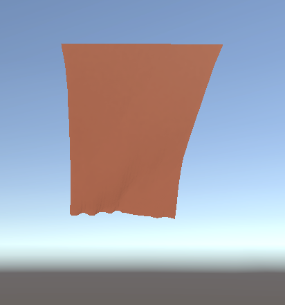
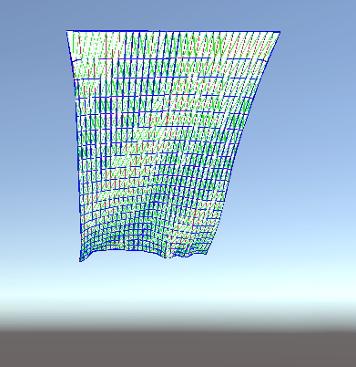
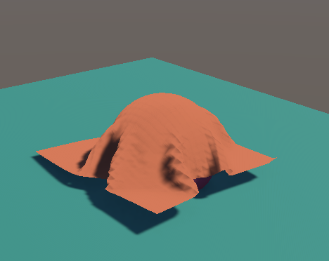
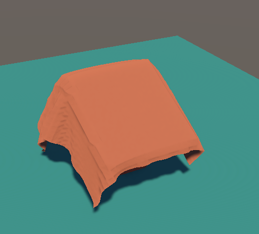

# 🧵 Real-Time Cloth Physics Simulation

This project describes a **from-scratch real-time cloth physics simulation** implemented in **Unity**, designed to explore and understand the core principles of cloth modeling, numerical integration, and collision handling in computer graphics.

---

## 🧩 Features Implemented

- Mass–spring cloth model with structural, shear, and bend constraints  
- Spring, damping, wind, drag, and gravity forces  
- Semi-implicit Euler, Verlet, and Position-Based Dynamics (PBD) integrators  
- Cloth collision with spheres, cubes, a ground plane, and arbitrary triangle meshes (PBD only)  
- Bounding Volume Hierarchy (BVH) construction from triangle meshes on the CPU  
- BVH flattening into linear arrays for efficient GPU traversal  
- GPU compute shader–based BVH traversal and cloth–mesh collision detection  
- Real-time interaction, runtime parameter tuning, and debug visualization

## 🖼️ Sample Results

### Cloth surface and mass–spring constraint visualization

  
    

### Cloth collision with sphere, cube, and triangle mesh

  
  
  

